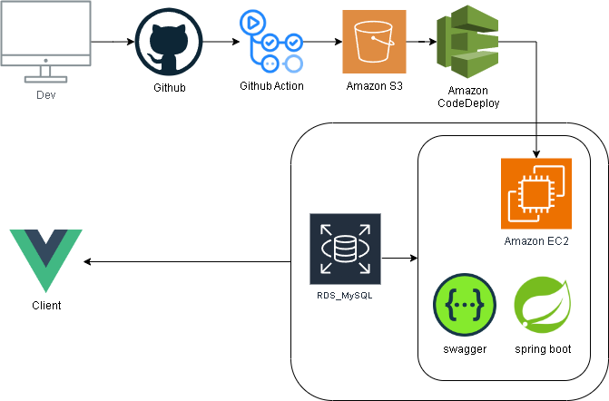
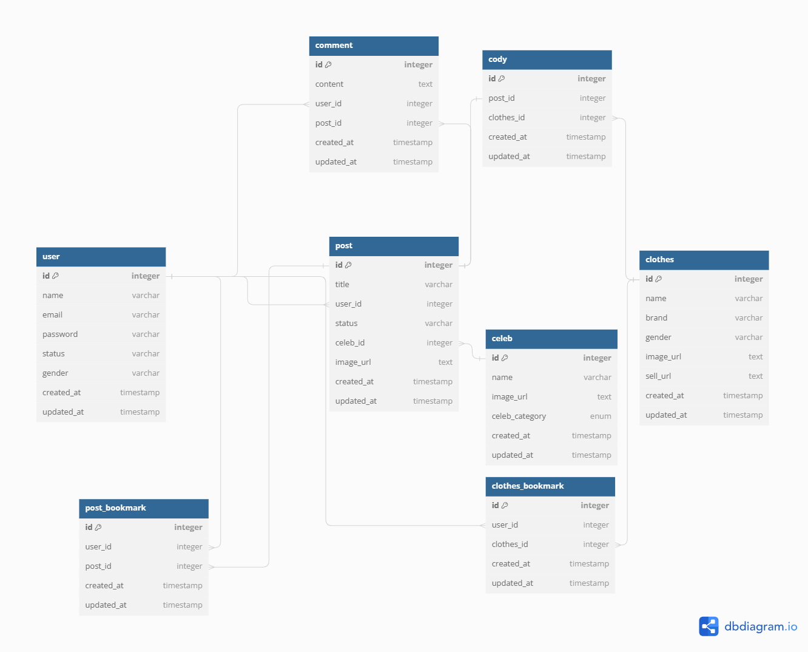

# spring-cody-backend

### 프로젝트 설명

**celep**은 셀럽들의 코디와 옷 정보를 공유하는 웹 서비스입니다.

## 기술 스택

### 애플리케이션 (Language & Framework)

- **Language** - Java 17
- **Framework** - Spring Framework 3.X (Spring Boot, Spring MVC)
- **Data(RDBMS)** - JPA/Hibernate, MySQL
- **Build Tool** - Gradle-Kotlin
- **Infra** - AWS EC2, AWS S3, AWS RDS
- **DB** - MySQL(RDS)
- **CI/CD** - Github Actions, AWS CodeDeploy
- **API Sheet** - Swagger

### 인프라 아키텍처

### ERD

[dbdiagram 링크](https://dbdocs.io/pch3310/celep_dbdiagram)

#### 추가로 레포를 보시고 질문이 있으시거나 개선사항을 확인하셨다면 언제든지 이슈를 남겨주세요!